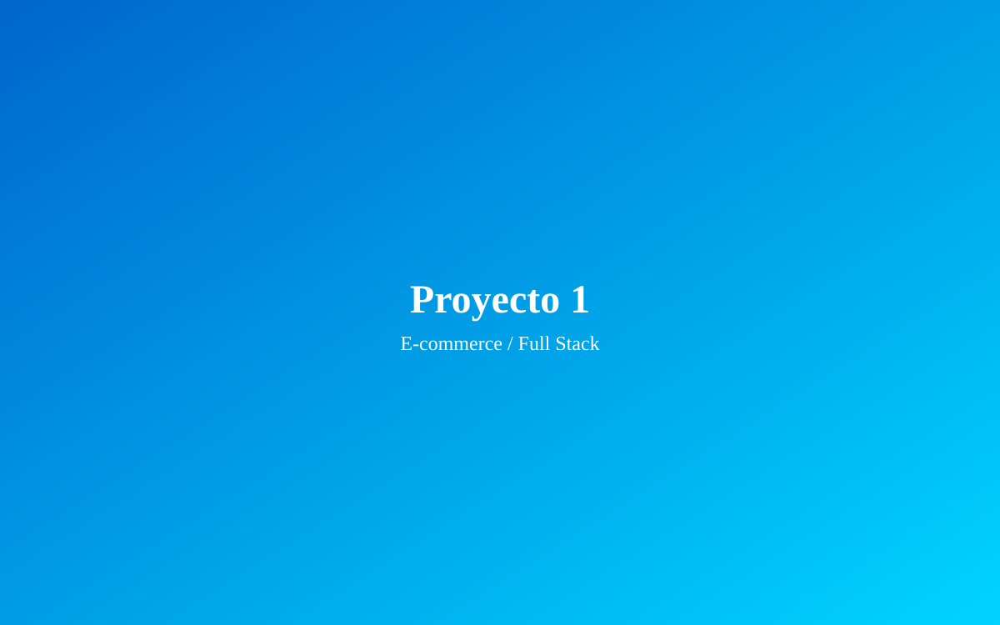
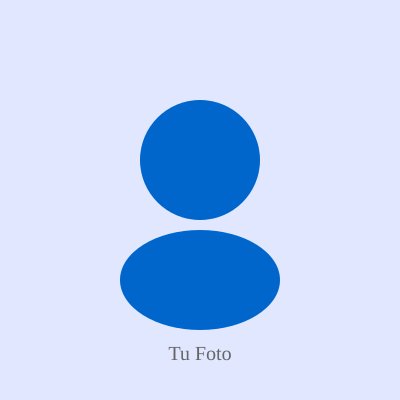

<!-- TEMPLATE DE PERSONALIZACIÓN RÁPIDA -->

<!-- ============================================
     PASO 1: INFORMACIÓN PERSONAL BÁSICA
     ============================================ -->

<!-- En index.html, busca y reemplaza: -->

<!-- Línea ~2: Cambiar título de página -->
<title>Mi Portfolio | Desarrollador Full Stack</title>
<!-- Por: -->
<title>Tu Nombre | Desarrollador Full Stack</title>

<!-- Línea ~112: Cambiar nombre en navbar -->
<a href="#top" class="logo">TuNombre</a>
<!-- Por: -->
<a href="#top" class="logo">Tu Nombre Real</a>

<!-- Línea ~133: Hero title -->
<h1 class="hero-title">Hola, soy Tu Nombre</h1>
<!-- Por tu nombre -->

<!-- ============================================
     PASO 2: CAMBIAR COLORES DEL TEMA
     ============================================ -->

<!-- En css/styles.css, línea ~10: -->
:root {
    /* Colors - Dark Theme */
    --primary-color: #00a8ff;      /* Azul principal */
    --primary-dark: #0088cc;       /* Azul oscuro */
    --primary-light: #1a3a52;      /* Azul claro */
    --secondary-color: #00d4ff;    /* Cian */
}

<!-- Ejemplos de otros colores: -->
/* Morado */
--primary-color: #a855f7;

/* Violeta */
--primary-color: #7c3aed;

/* Rosa */
--primary-color: #ec4899;

/* Verde */
--primary-color: #10b981;

/* Rojo */
--primary-color: #ef4444;

<!-- ============================================
     PASO 3: CAMBIAR EXPERIENCIA LABORAL
     ============================================ -->

<!-- En index.html, busca "Desarrollador Senior" (~línea 170) -->

<!-- Reemplaza COMPLETO este bloque: -->

    

        <h3>Desarrollador Senior</h3>
        
Empresa Actual

    

    
Enero 2024 - Presente

    <ul class="responsibilities">
        <li>Lideré el desarrollo de aplicaciones web escalables</li>
        <li>Implementé soluciones de automatización con n8n</li>
        <li>Mentoreé a desarrolladores junior en buenas prácticas</li>
        <li>Optimicé performance en aplicaciones React</li>
    </ul>
    

        React
        Node.js
        n8n
        PostgreSQL
    

<!-- ============================================
     PASO 4: AGREGAR PROYECTOS REALES
     ============================================ -->

<!-- En index.html, busca "E-commerce Tienda Online" (~línea 288) -->

<!-- Reemplaza el bloque del proyecto: -->

    

        
        <!-- Reemplaza con tu imagen JPG/PNG -->
        <!--  -->
        

            <a href="https://tu-proyecto.com" target="_blank" class="btn btn-small">Ver Proyecto</a>
        

    

    

        <h3>Nombre de tu Proyecto</h3>
        

            Descripción breve de qué hace el proyecto
        

        

            Tech1
            Tech2
            Tech3
        

        

            <a href="https://proyecto.com" target="_blank" class="link-icon" title="Ver en vivo">🔗</a>
            <a href="https://github.com/tuusuario/proyecto" target="_blank" class="link-icon" title="Ver código">💻</a>
        

    

<!-- ============================================
     PASO 5: ACTUALIZAR LINKS DE CONTACTO
     ============================================ -->

<!-- En index.html, busca las secciones de contacto (~línea 380): -->

<!-- Email -->
<a href="mailto:tu.email@ejemplo.com" class="contact-card">
    
✉️

    <h3>Email</h3>
    
tu.email@ejemplo.com

</a>

<!-- WhatsApp -->
<a href="https://wa.me/TU_NUMERO_AQUI" target="_blank" class="contact-card">
    
💬

    <h3>WhatsApp</h3>
    
+54 9 2494 xxxxxx

</a>

<!-- LinkedIn -->
<a href="https://linkedin.com/in/TU_USUARIO" target="_blank" class="contact-card">
    
💼

    <h3>LinkedIn</h3>
    
Ver Perfil

</a>

<!-- GitHub -->
<a href="https://github.com/TU_USUARIO" target="_blank" class="contact-card">
    
⚙️

    <h3>GitHub</h3>
    
Ver Proyectos

</a>

<!-- ============================================
     PASO 6: AGREGAR IMÁGENES REALES
     ============================================ -->

<!-- 1. Descarga tus imágenes -->
<!-- 2. Guárdelas en assets/images/ -->
<!-- 3. Cambia las rutas de .svg a .jpg o .png -->

<!-- De: -->

<!-- A: -->

<!-- ============================================
     PASO 7: EDITAR SECCIÓN SOBRE MÍ
     ============================================ -->

<!-- En index.html, busca "Sobre Mí" (~línea 360) -->

<!-- Reemplaza el texto con tu historia -->

    Soy un desarrollador Full Stack apasionado por crear experiencias web memorables. 
    Con más de 3 años de experiencia, he trabajado en proyectos desde startups hasta 
    empresas establecidas.

<!-- ============================================
     PASO 8: CAMBIAR TIPOGRAFÍA
     ============================================ -->

<!-- En css/styles.css, línea ~18: -->
@import url('https://fonts.googleapis.com/css2?family=Poppins:wght@300;400;500;600;700&display=swap');

<!-- Otras opciones: -->
/* Inter (Muy popular) */
@import url('https://fonts.googleapis.com/css2?family=Inter:wght@300;400;500;600;700&display=swap');

/* Montserrat */
@import url('https://fonts.googleapis.com/css2?family=Montserrat:wght@300;400;500;600;700&display=swap');

/* Playfair Display (Para títulos elegantes) */
@import url('https://fonts.googleapis.com/css2?family=Playfair+Display:wght@700&display=swap');

<!-- ============================================
     CHECKLIST DE PERSONALIZACIÓN
     ============================================ -->

☐ Actualizar nombre en navbar y hero
☐ Cambiar descripción profesional
☐ Actualizar experiencia laboral (3 elementos)
☐ Agregar/cambiar proyectos (3 elementos)
☐ Actualizar sección "Sobre mí"
☐ Cambiar habilidades (Frontend, Backend, Herramientas)
☐ Actualizar links de contacto
☐ Agregar imágenes reales (5 imágenes mínimo)
☐ Probar en móvil/tablet/desktop
☐ Verificar que no haya errores en console (F12)
☐ Verificar que todos los links funcionen
☐ Hacer commit final: git commit -m "Personalized portfolio"

¡Listo! Tu portfolio está personalizado y listo para desplegar 🎉
